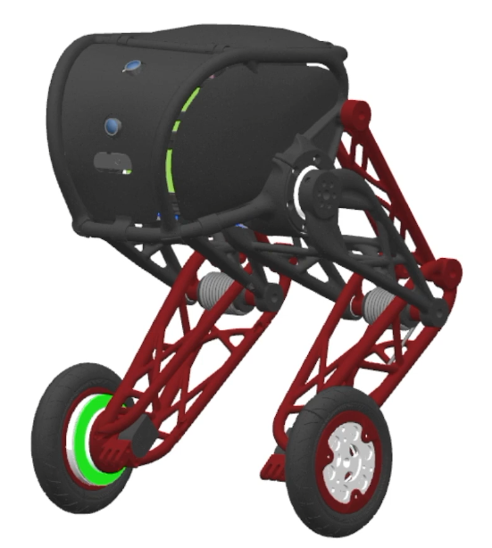

# Segway con piernas extensibles

Trabajo final de la cátedra **Robótica II** de la **Universidad Nacional de Cuyo (UNCUYO)**.

Este repositorio reúne la documentación, el diseño y el desarrollo de un Segway con piernas extensibles.

## Estructura

- `base_conocimiento/`: conceptos, decisiones y notas consolidadas.
- `guias_catedra/`: procedimientos y material de apoyo de la cátedra.
- `referencias/`: bibliografía, normas y recursos de consulta.
- `diseño_mecanico/`: CAD, cálculos y documentación mecánica.
- `electronica/`: esquemas, selección de componentes y cableado.
- `simulacion/`: modelos, escenarios y resultados de simulación.
- `firmware/`: software embebido y control del robot.
- `assets/`: imágenes utilizadas por la documentación del repositorio.

## Guías incorporadas

- [Procedimiento de dimensionamiento de batería](guias_catedra/procedimiento_dimensionamiento_bateria_robotica_II_UNCUYO.md)
- [Procedimiento de preselección de servos](guias_catedra/procedimiento_preseleccion_servos_robotica_II_UNCUYO.md)

## Convención para archivos PDF

Los archivos PDF no se leen directamente. Si una respuesta necesita información contenida en un PDF, primero debe convertirse a Markdown siguiendo las reglas de [AGENTS.md](AGENTS.md); la consulta se realiza luego sobre el archivo `.md` generado.
