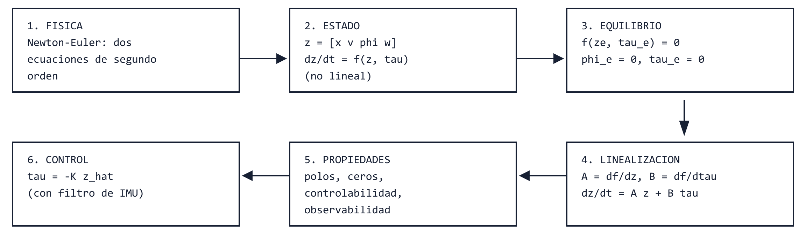
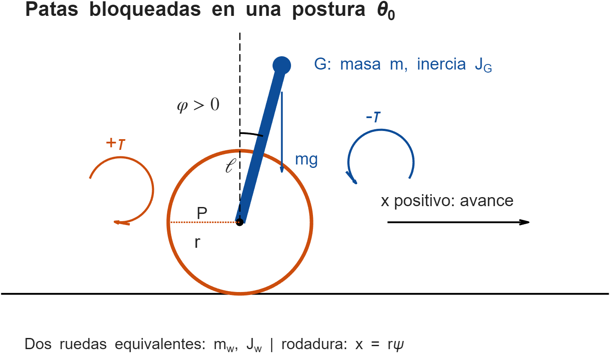
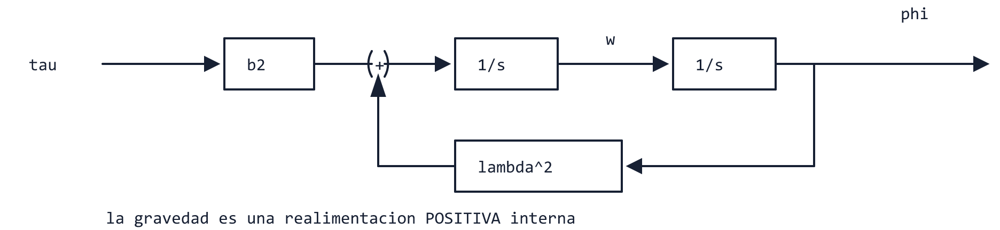
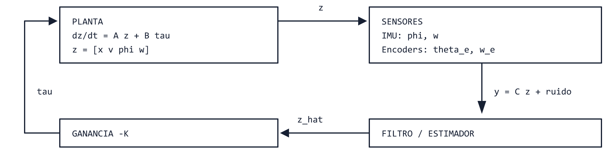

# Péndulo invertido sobre ruedas en el espacio de estados

Proyecto Segway con patas — Robótica II, UNCUYO. Fecha: **2026-10-04**.

Este capítulo vuelve a recorrer el problema del [capítulo anterior](desarrollo_matematico.md), pero con
otro orden de exposición: **el estado y las matrices $\mathbf A$ y $\mathbf B$ pasan al centro, y la física
queda ubicada como el paso que fabrica la función $\mathbf f$ que el estado necesita.** No hay código:
los scripts ya existen y se citan al final. Todo lo que aparece aquí se reverificó numéricamente contra
la $\mathbf A$ y la $\mathbf B$ de la [corrida base](../../../simulacion/pendulo_invertido/resultados/resultado_base.md).

El tono sigue el de *Feedback Systems* de Åström y Murray: primero la idea, después un ejemplo
pequeño, después el caso real, y al final de cada tramo qué se aprendió. Las citas al libro son a
capítulos y secciones; no se reproducen sus textos.

## 0. Tres preguntas, tres respuestas cortas

Este capítulo nace de tres preguntas concretas. Conviene tener las respuestas a mano antes de entrar
en los detalles, porque el resto del texto las justifica.

**¿Por qué el capítulo anterior «no usa» el espacio de estados?** Sí lo usa, pero tarde: recién en su
§18, como empaque del resultado. Su camino es *mecánica → ecuaciones de segundo orden → estado*. El
espacio de estados no es una alternativa a la física, es **la forma en que se guarda el resultado de la
física** para poder simular, analizar y controlar. Aquí se invierte el énfasis, no la lógica.

**¿Se pueden plantear directamente variables de estado y matrices?** Las variables, sí: se eligen. Las
matrices, no «de la nada»: $\mathbf A$ y $\mathbf B$ contienen la masa equivalente, la gravedad y el
modo en que el motor empuja, y eso sale de Newton o de Lagrange. Lo que sí se puede es **saltear la
física no lineal**: las matrices del modelo lineal salen directamente de dos objetos pequeños, la matriz
de masa evaluada en el equilibrio y la curvatura de la energía potencial (§6.3). Ese es el atajo legítimo.

**¿Puede el seno tratarse como una perturbación gravitatoria medida con la IMU?** Es una intuición
razonable, pero con dos matices importantes (§7). Primero, la gravedad no es una perturbación *externa*:
depende del propio ángulo y por eso es una realimentación positiva interna. Segundo, y es lo central:
**la inestabilidad ya está en el modelo lineal.** Quitar el seno (linealizar) no la elimina; el término
que desestabiliza es $+k\varphi$, no la curvatura del seno. Cancelarlo con la medición de la IMU es
posible y útil, pero equivale a realimentar el ángulo, y no alcanza por sí solo (el robot tiene dos
grados de libertad y un solo motor).

*Figura 1. Hoja de ruta del capítulo. Fuente editable: [`diagramas/ruta_modelado_estado.bob`](diagramas/ruta_modelado_estado.bob);
vectorial: [`.svg`](diagramas/ruta_modelado_estado.svg).*

## 1. Qué es el estado, con un ejemplo que cabe en la mano

Un modelo dinámico responde a esta pregunta: *si sé cómo está el sistema ahora y qué le hago a
partir de ahora, ¿puedo predecir qué pasará?* El **estado** es el conjunto mínimo de números que
hace falta conocer «ahora» para que la respuesta sea sí (Åström–Murray, §3.1). En mecánica la
segunda ley de Newton relaciona **aceleraciones** con fuerzas; para empezar a integrar hay que dar
posiciones y **velocidades** iniciales. Por eso el estado de un sistema mecánico contiene, para cada
coordenada, su valor y su derivada.

La forma estándar es

$$
\dot{\mathbf z}=\mathbf f(\mathbf z,u),\qquad \mathbf y=\mathbf h(\mathbf z), \tag{1}
$$

con $\mathbf z$ el estado, $u$ la entrada de control y $\mathbf y$ lo que se mide. Se usa $\mathbf z$ y no
$\mathbf x$ porque $x$ ya es la posición del robot.

### Ejemplo 1. Un péndulo con par en el pivote

Antes del Segway conviene recorrer todo el método en un sistema de un solo grado de libertad. Sea un
cuerpo con inercia $j$ respecto de un pivote fijo, cuyo centro de masa está a distancia $\ell$ del
pivote. El ángulo $\varphi$ se mide desde la vertical hacia arriba, positivo antihorario, como en el
resto del proyecto, y $u$ es un par en el pivote, también positivo antihorario. La gravedad produce
el par $mg\ell\sin\varphi$: con $\varphi>0$ el centro de masa queda a la izquierda del pivote y cae
más hacia la izquierda, es decir, aumenta $\varphi$. Con $k=mg\ell$, Newton para el giro da

$$
j\,\ddot\varphi=k\sin\varphi+u. \tag{2}
$$

**Paso 1: elegir el estado.** La ecuación es de segundo orden, así que se necesitan dos variables:
$\mathbf z=[\varphi\;\;\omega]^T$ con $\omega=\dot\varphi$.

**Paso 2: escribir $\mathbf f$.** Cada componente de $\dot{\mathbf z}$ se expresa con $\mathbf z$ y $u$:

$$
\dot{\mathbf z}=\begin{bmatrix}\omega\\[2pt]\dfrac{k}{j}\sin\varphi+\dfrac{u}{j}\end{bmatrix}. \tag{3}
$$

La primera fila es una identidad (la definición de $\omega$); toda la física está en la segunda.

**Paso 3: buscar equilibrios.** Son los estados que no cambian: $\mathbf f(\mathbf z_e,u_e)=\mathbf 0$.
Con $u_e=0$ resulta $\omega_e=0$ y $\sin\varphi_e=0$, o sea $\varphi_e=0$ (arriba) o $\varphi_e=\pi$ (abajo).

**Paso 4: linealizar.** Alrededor de un equilibrio, $\mathbf f$ se reemplaza por su desarrollo de Taylor de
primer orden (Åström–Murray, §5.3 y §6.4). Las matrices son las derivadas parciales evaluadas ahí:

$$
\mathbf A=\left.\frac{\partial\mathbf f}{\partial\mathbf z}\right|_{e}
=\begin{bmatrix}0&1\\ \dfrac kj\cos\varphi_e&0\end{bmatrix},\qquad
\mathbf B=\left.\frac{\partial\mathbf f}{\partial u}\right|_{e}=\begin{bmatrix}0\\1/j\end{bmatrix}. \tag{4}
$$

**Paso 5: leer $\mathbf A$.** Sus autovalores cumplen $s^2=(k/j)\cos\varphi_e$. Arriba ($\cos 0=1$)
son $\pm\sqrt{k/j}$: uno real positivo, o sea inestable. Abajo ($\cos\pi=-1$) son imaginarios puros:
oscila. Con esto se demostró en una línea lo que la intuición ya sabía.

**Observación: aquí la gravedad *sí* se cancela sin esfuerzo.** Si en (2) se elige
$u=-k\sin\varphi+u'$, resulta $j\ddot\varphi=u'$: un doble integrador. Esto es posible porque el motor
actúa **directamente** sobre la única coordenada que hay. Es el truco clásico de compensación de
gravedad en brazos robot. La pregunta del §7 es si ese truco sigue funcionando en el Segway; adelanto
que parcialmente.

> **Resumen del §1.** Estado = valores y velocidades de las coordenadas. Receta: elegir $\mathbf z$,
> escribir $\dot{\mathbf z}=\mathbf f(\mathbf z,u)$, buscar equilibrios, derivar para obtener
> $\mathbf A$ y $\mathbf B$, leer los autovalores. Eso es todo el método. El resto del capítulo aplica
> la misma receta con cuatro estados.

## 2. El Segway como sistema físico

Las hipótesis, la convención de signos y el cálculo del cuerpo equivalente son los del
[capítulo anterior](desarrollo_matematico.md) (§§2–5); no se repiten. Aquí solo se recuerda lo que
hace falta para leer las ecuaciones.

*Figura 2. Convenciones: $x$ positivo hacia adelante; $\varphi$, $\psi$ y los pares positivos en sentido
antihorario. Con $\varphi>0$ el centro de masa queda atrás del eje.*

Las patas están bloqueadas en una postura, de modo que el cuerpo suspendido es un único cuerpo rígido.
Hay **dos grados de libertad** (la posición $x$ del eje y la inclinación $\varphi$) y **una entrada**:
el par total $\tau$ de las dos ruedas. Es un sistema **subactuado**: más coordenadas que actuadores.
Todo lo interesante del problema viene de ahí.

Los parámetros entran por cuatro combinaciones, que conviene tratar como las «constantes» del modelo:

$$
a=m+m_w+\frac{J_w}{r^2},\qquad h=m\ell,\qquad j=J_G+m\ell^2,\qquad k=mg\ell. \tag{5}
$$

Para la postura de 25° del capítulo anterior valen aproximadamente $a=1{,}1498$ kg,
$h=0{,}07924$ kg·m, $j=0{,}010318$ kg·m², $k=0{,}7774$ N·m, con $r=0{,}033$ m.

Hay una diferencia esencial con el sistema del libro (carrito con péndulo, Åström–Murray, Ejemplo 3.2):
allí la entrada es una **fuerza $F$ sobre el carrito**. Aquí el motor está *dentro* del robot: empuja
las ruedas hacia un lado y, por reacción, empuja el cuerpo hacia el otro. Más adelante se verá que
esto se resume en un único vector de entrada $\mathbf H=[-1/r,\,-1]^T$.

## 3. La física: Newton–Euler sobre dos cuerpos

El capítulo anterior dedujo las ecuaciones con Lagrange. Para variar, aquí se usa Newton–Euler, que
muestra las fuerzas internas y entrega de regalo las fuerzas de contacto. Las dos rutas deben dar lo
mismo; esa coincidencia es una verificación cruzada.

### 3.1. Diagrama de cuerpo libre

El robot se separa en el cuerpo suspendido (masa $m$, inercia $J_G$ respecto de su centro $G$) y las
ruedas (masa $m_w$, inercia $J_w$). El cuerpo se articula con las ruedas en el eje $P$.

| Cuerpo | Fuerza o par | Dónde | Sentido positivo |
|---|---|---|---|
| Ruedas | peso $m_wg$ | en $P$ | hacia abajo |
| Ruedas | normal $N$ | en el contacto | hacia arriba |
| Ruedas | fuerza tangencial $F$ | en el contacto, a $r$ bajo $P$ | hacia adelante |
| Ruedas | fuerza del cuerpo $(O_x,O_y)$ | en $P$ | $+x$, $+y$ |
| Ruedas | par del motor $+\tau$ | en el eje | antihorario |
| Cuerpo | peso $mg$ | en $G$ | hacia abajo |
| Cuerpo | reacción $(-O_x,-O_y)$ | en $P$ | tercera ley de Newton |
| Cuerpo | par de reacción $-\tau$ | en el eje | horario |

Hay seis incógnitas: $\ddot x,\ \ddot\varphi,\ O_x,\ O_y,\ F,\ N$. Las ecuaciones disponibles son tres para
las ruedas y tres para el cuerpo, o sea seis. El problema está bien planteado.

### 3.2. Las seis ecuaciones

Ruedas (el giro $\psi$ es antihorario y la fuerza $F$, aplicada a $r$ bajo el eje, produce un momento
antihorario $Fr$):

$$
m_w\ddot x=F+O_x,\qquad 0=N-m_wg+O_y,\qquad J_w\ddot\psi=\tau+Fr. \tag{6}
$$

Rodadura sin deslizar, con $x$ hacia adelante y $\psi$ antihorario:

$$
\ddot\psi=-\frac{\ddot x}{r}. \tag{7}
$$

Cuerpo. Su centro está en $x_G=x-\ell\sin\varphi$, $y_G=r+\ell\cos\varphi$, de donde
$\ddot x_G=\ddot x-\ell\cos\varphi\,\ddot\varphi+\ell\sin\varphi\,\dot\varphi^2$ y
$\ddot y_G=-\ell\sin\varphi\,\ddot\varphi-\ell\cos\varphi\,\dot\varphi^2$. Las ecuaciones de traslación y giro son

$$
m\ddot x_G=-O_x,\qquad m\ddot y_G=-O_y-mg,\qquad
J_G\ddot\varphi=-\tau-\ell\cos\varphi\,O_x-\ell\sin\varphi\,O_y. \tag{8}
$$

La última sale de aplicar la fuerza $(-O_x,-O_y)$ en $P$ y sumar su momento respecto de $G$, con
$\mathbf r_P-\mathbf r_G=(\ell\sin\varphi,\,-\ell\cos\varphi)$, más el par de reacción $-\tau$.

### 3.3. Eliminar las fuerzas internas

La estrategia es despejar las incógnitas en cadena, de modo que cada una se calcule con las ya conocidas.

1. De (6) y (7), la fuerza tangencial requerida para que la rueda ruede es
$$F=-\frac{\tau}{r}-\frac{J_w}{r^2}\ddot x. \tag{9}$$
2. De la primera de (6), $O_x=m_w\ddot x-F=\left(m_w+\dfrac{J_w}{r^2}\right)\ddot x+\dfrac\tau r$.
3. Se lleva ese $O_x$ a la primera de (8) y se usa $\ddot x_G$:
$$m\big(\ddot x-\ell\cos\varphi\,\ddot\varphi+\ell\sin\varphi\,\dot\varphi^2\big)=-\left(m_w+\frac{J_w}{r^2}\right)\ddot x-\frac\tau r.$$
Pasando todo al lado izquierdo y usando los coeficientes (5) queda la **primera ecuación de movimiento**:
$$\boxed{a\,\ddot x-h\cos\varphi\,\ddot\varphi+h\sin\varphi\,\dot\varphi^2=-\frac{\tau}{r}.} \tag{10}$$
4. De la segunda de (8), $O_y=m\ell\left(\sin\varphi\,\ddot\varphi+\cos\varphi\,\dot\varphi^2\right)-mg$.
5. Se reemplazan $O_x=-m\ddot x_G$ y este $O_y$ en el balance de momentos (último de (8)). Tres cosas
ocurren a la vez: los términos en $\dot\varphi^2$ se cancelan exactamente, $\cos^2\varphi+\sin^2\varphi$
se simplifica a 1 y el peso aporta $+mg\ell\sin\varphi$. El resultado es la **segunda ecuación de movimiento**:
$$\boxed{-h\cos\varphi\,\ddot x+j\,\ddot\varphi-k\sin\varphi=-\tau.} \tag{11}$$
6. Con las aceleraciones ya conocidas, la normal sale de la segunda de (6):
$$N=(m+m_w)g-m\ell\left(\sin\varphi\,\ddot\varphi+\cos\varphi\,\dot\varphi^2\right). \tag{12}$$

Las ecuaciones (10) y (11) son idénticas a las (26) y (27) del capítulo anterior, obtenidas con Lagrange.
Eso confirma tanto el álgebra como los signos. Las fórmulas (9) y (12) sirven para comprobar que el
modelo sigue siendo válido: hay que exigir $N>0$ y $|F|\le\mu_sN$.

**Comparación con el libro.** Sus ecuaciones de la planta carrito–péndulo (Åström–Murray, Ejemplo 3.2 y
Ejemplo 7.2) tienen exactamente la misma estructura que (10) y (11), con $M+m\leftrightarrow a$,
$ml\leftrightarrow h$ y $J+ml^2\leftrightarrow j$. La diferencia está en el miembro derecho. En el libro es
$[F,\,0]^T$. Aquí es
$$\begin{bmatrix}-\tau/r\\-\tau\end{bmatrix}=\mathbf H\tau=F_{\rm eq}\begin{bmatrix}1\\ r\end{bmatrix},\qquad F_{\rm eq}=-\frac\tau r,$$
es decir, **una fuerza sobre el carrito más un par $rF_{\rm eq}$ sobre el cuerpo**, producto del motor
interno. Todo lo que el libro demuestra sobre el carrito se traslada, cambiando solo ese vector.

**Verificación contra el libro.** Se comprobó contra las páginas del PDF (3-12 y 3-13, 7-4 y 7-5) que
(10) y (11) coinciden término a término con la ec. (3.9) y con la (7.4), y que las entradas $G_1=m^2\ell^2g/\mu$
y $G_2=M_tmg\ell/\mu$ de la matriz $\mathbf A$ linealizada del Ejemplo 3.2 son las que da (25), con
$\mu=M_tJ_t-m^2\ell^2=aj-h^2=\Delta_0$. Con la entrada del libro, $\mathbf H=[1,\,0]^T$, la columna de
entrada de (25) vuelve a ser $(J_t/\mu,\ lm/\mu)$, que es su $\mathbf B$.

### 3.4. Pérdidas

Se conservan los tres coeficientes viscosos del capítulo anterior (su §13 deduce el origen de cada
uno): $b_e$ en el eje, $b_x$ de arrastre horizontal y $b_\varphi$ de arrastre de cabeceo. Son supuestos
de modelado, no valores identificados. Con la velocidad relativa de la rueda respecto del cuerpo,
$\omega_{\rm rel}=-\dot x/r-\dot\varphi$, y el par neto del eje $\tau_e=\tau-b_e\omega_{\rm rel}$, las
ecuaciones se completan así:

$$
\begin{aligned}
a\ddot x-h\cos\varphi\,\ddot\varphi+h\sin\varphi\,\dot\varphi^2&=-\frac{\tau_e}{r}-b_x\dot x,\\
-h\cos\varphi\,\ddot x+j\ddot\varphi-k\sin\varphi&=-\tau_e-b_\varphi\dot\varphi.
\end{aligned} \tag{13}
$$

## 4. El modelo no lineal en espacio de estados

### 4.1. Elegir el estado

Hay dos coordenadas y cada ecuación es de segundo orden, así que el estado tiene cuatro componentes.
Se adopta el mismo orden que usan los scripts del repositorio:

$$
\mathbf z=\begin{bmatrix}x&v&\varphi&\omega\end{bmatrix}^T,\qquad v=\dot x,\quad\omega=\dot\varphi. \tag{14}
$$

Las filas 1 y 3 de $\dot{\mathbf z}$ son identidades cinemáticas ($\dot x=v$, $\dot\varphi=\omega$). Las filas
2 y 4 contienen la física.

### 4.2. Despejar las aceleraciones

Las ecuaciones (13) forman un sistema lineal en $(\ddot x,\ddot\varphi)$ con coeficientes que dependen del
estado:

$$
\underbrace{\begin{bmatrix}a&-h\cos\varphi\\-h\cos\varphi&j\end{bmatrix}}_{\mathbf M(\varphi)}
\begin{bmatrix}\ddot x\\\ddot\varphi\end{bmatrix}
=\underbrace{\begin{bmatrix}-h\sin\varphi\,\omega^2-b_xv\\k\sin\varphi-b_\varphi\omega\end{bmatrix}}_{\text{términos de }\mathbf z}
+\underbrace{\begin{bmatrix}-1/r\\-1\end{bmatrix}}_{\mathbf H}\tau_e. \tag{15}
$$

Al reemplazar $\tau_e=\tau-b_e(-v/r-\omega)$, todo el miembro derecho queda **afín en $\tau$**:
$\mathbf w(\mathbf z)+\mathbf H\tau$, con

$$
\mathbf w(\mathbf z)=\begin{bmatrix}
-\left(b_x+\dfrac{b_e}{r^2}\right)v-\dfrac{b_e}{r}\omega-h\sin\varphi\,\omega^2\\[6pt]
-\dfrac{b_e}{r}v-(b_e+b_\varphi)\omega+k\sin\varphi
\end{bmatrix}. \tag{16}
$$

La matriz $\mathbf M(\varphi)$ es invertible siempre: su determinante $\Delta(\varphi)=aj-h^2\cos^2\varphi$
es positivo para cualquier masa e inercia física. Con $\mathbf M^{-1}=\dfrac1\Delta\begin{bmatrix}j&h\cos\varphi\\h\cos\varphi&a\end{bmatrix}$,
el modelo completo es

$$
\boxed{\dot{\mathbf z}=\mathbf f(\mathbf z,\tau)=
\begin{bmatrix}v\\ \big[\mathbf M^{-1}(\mathbf w+\mathbf H\tau)\big]_1\\ \omega\\ \big[\mathbf M^{-1}(\mathbf w+\mathbf H\tau)\big]_2\end{bmatrix}.} \tag{17}
$$

### 4.3. Tres propiedades que ya se pueden leer

1. **$\mathbf f$ no depende de $x$.** La posición no aparece en el miembro derecho: el piso es
   homogéneo y no hay resorte que la sostenga. Se dice que $x$ es una *coordenada cíclica*. Veremos que
   esto fuerza un autovalor exactamente igual a cero.
2. **$\mathbf f$ es afín en la entrada:** $\dot{\mathbf z}=\mathbf f_0(\mathbf z)+\mathbf g(\mathbf z)\tau$.
   Esta es la estructura que hace posible cancelar términos con la entrada (§7).
3. **El motor entra por $\mathbf H$.** Esa misma $\mathbf H$ aparece en la velocidad relativa:
   $\omega_{\rm rel}=\mathbf H^T\dot{\mathbf q}$ con $\mathbf q=[x,\varphi]^T$. Más adelante se usará.

## 5. Equilibrio

Un equilibrio cumple $\mathbf f(\mathbf z_e,\tau_e)=\mathbf 0$. De $\dot x=\dot\varphi=0$ sale $v_e=\omega_e=0$, y
entonces $\mathbf w$ solo conserva el término $k\sin\varphi$. La fila 1 de (15) pide $-\tau_e/r=0$, o
sea $\tau_e=0$. La fila 2 pide entonces $k\sin\varphi_e=0$. En la rama invertida:

$$
\mathbf z_e=\begin{bmatrix}x_e&0&0&0\end{bmatrix}^T,\qquad\tau_e=0, \tag{18}
$$

con $x_e$ cualquiera: hay una **recta de equilibrios**, porque el robot puede estar quieto en
cualquier punto del piso. Que el ángulo de equilibrio sea $\varphi_e=0$ significa «centro de masa
justo encima del eje». El ángulo del chasis correspondiente, que es lo que mide la IMU, es
$\beta_{\rm eq}=-\delta_G$ (capítulo anterior, §5).

Un cuerpo inclinado no está en equilibrio sobre ruedas libres ni siquiera con $\tau=k\sin\varphi$: esa
fórmula presupone un eje inmovilizado. En el modelo, esa situación no es un punto de equilibrio.

## 6. Linealización

### 6.1. La idea

Se estudian apartamientos pequeños $\delta\mathbf z=\mathbf z-\mathbf z_e$ y $\delta\tau=\tau-\tau_e$.
Como $\mathbf f(\mathbf z_e,\tau_e)=\mathbf 0$, el desarrollo de Taylor de primer orden da
$\delta\dot{\mathbf z}\simeq\mathbf A\,\delta\mathbf z+\mathbf B\,\delta\tau$ con

$$
\mathbf A=\left.\frac{\partial\mathbf f}{\partial\mathbf z}\right|_e,\qquad
\mathbf B=\left.\frac{\partial\mathbf f}{\partial\tau}\right|_e. \tag{19}
$$

Tomando $x_e=0$ y escribiendo de nuevo $\mathbf z$ y $\tau$ para las desviaciones, el modelo es
$\dot{\mathbf z}=\mathbf A\mathbf z+\mathbf B\tau$.

### 6.2. Cálculo de $\mathbf A$ y $\mathbf B$ por derivación

Las filas 1 y 3 son triviales. Para las filas 2 y 4 hay que derivar $\mathbf M^{-1}(\varphi)(\mathbf w+\mathbf H\tau)$,
que es un producto de dos factores que dependen del estado. Por la regla del producto:

$$
\frac{\partial}{\partial\mathbf z}\Big[\mathbf M^{-1}(\mathbf w+\mathbf H\tau)\Big]
=\mathbf M^{-1}\frac{\partial(\mathbf w+\mathbf H\tau)}{\partial\mathbf z}
+\frac{\partial\mathbf M^{-1}}{\partial\mathbf z}\,(\mathbf w+\mathbf H\tau). \tag{20}
$$

El segundo sumando **desaparece en el equilibrio**, porque allí $\mathbf w+\mathbf H\tau=\mathbf 0$ (las
aceleraciones son nulas). Por eso, a primer orden, **alcanza con evaluar $\mathbf M$ en el equilibrio**,
$\mathbf M_0=\mathbf M(0)$, sin derivarla. Es la razón matemática por la que la linealización de un
sistema mecánico es tan simple.

Quedan las derivadas de (16). En el equilibrio, $\cos\varphi=1$ y los productos $\omega^2$ y
$\sin\varphi\,\omega$ valen cero:

$$
\frac{\partial\mathbf w}{\partial v}=\begin{bmatrix}-(b_x+b_e/r^2)\\-b_e/r\end{bmatrix},\quad
\frac{\partial\mathbf w}{\partial\varphi}=\begin{bmatrix}0\\k\end{bmatrix},\quad
\frac{\partial\mathbf w}{\partial\omega}=\begin{bmatrix}-b_e/r\\-(b_e+b_\varphi)\end{bmatrix},\quad
\frac{\partial(\mathbf H\tau)}{\partial\tau}=\mathbf H. \tag{21}
$$

Se agrupan las pérdidas en la matriz simétrica $\mathbf D$ y se definen

$$
\mathbf M_0=\begin{bmatrix}a&-h\\-h&j\end{bmatrix},\qquad
\mathbf D=\begin{bmatrix}b_x+b_e/r^2&b_e/r\\b_e/r&b_e+b_\varphi\end{bmatrix}. \tag{22}
$$

Las derivadas de (21) son entonces las columnas de $-\mathbf D$ (velocidades), de $[0,k]^T$ (ángulo) y de
$\mathbf H$ (entrada).

### 6.3. El atajo: el modelo lineal desde las energías

Hay una forma de llegar a las mismas matrices sin derivar ninguna ecuación de movimiento. Es la que
responde a la pregunta «¿no se podrían plantear las matrices directamente?».

La energía cinética del capítulo anterior es $T=\tfrac12a\dot x^2-h\cos\varphi\,\dot x\dot\varphi+\tfrac12j\dot\varphi^2$
y la potencial $V=k\cos\varphi$. Basta aproximarlas a **segundo orden**:

$$
T\simeq\tfrac12\dot{\mathbf q}^T\mathbf M_0\dot{\mathbf q},\qquad
V\simeq k-\tfrac12k\varphi^2. \tag{23}
$$

La primera usa $\cos\varphi\simeq1$; la segunda, $\cos\varphi\simeq1-\varphi^2/2$. Lagrange sobre estas
dos energías cuadráticas produce directamente

$$
\mathbf M_0\ddot{\mathbf q}+\mathbf D\dot{\mathbf q}-\begin{bmatrix}0\\k\varphi\end{bmatrix}=\mathbf H\tau,
\qquad\mathbf q=\begin{bmatrix}x\\\varphi\end{bmatrix}. \tag{24}
$$

Es el mismo resultado que la derivación del §6.2. El mensaje práctico es que, **para un sistema
mecánico, el modelo lineal alrededor de un equilibrio queda determinado por tres objetos:** la
matriz de masa en ese punto, la curvatura de la energía potencial (aquí el escalar $k$) y el vector
$\mathbf H$ de cómo entra la fuerza. Los senos y cosenos nunca se derivan.

### 6.4. Las matrices

Con $\mathbf M_0^{-1}=\dfrac1{\Delta_0}\begin{bmatrix}j&h\\h&a\end{bmatrix}$ y $\Delta_0=aj-h^2$, se
despejan las aceleraciones de (24) y se arma el estado (14). Se definen los números

$$
\mathbf S=-\mathbf M_0^{-1}\mathbf D,\qquad
\begin{bmatrix}G_1\\G_2\end{bmatrix}=\mathbf M_0^{-1}\begin{bmatrix}0\\k\end{bmatrix}=\frac k{\Delta_0}\begin{bmatrix}h\\a\end{bmatrix},\qquad
\begin{bmatrix}b_1\\b_2\end{bmatrix}=\mathbf M_0^{-1}\mathbf H=\frac1{\Delta_0}\begin{bmatrix}-(j/r+h)\\-(h/r+a)\end{bmatrix}, \tag{25}
$$

y las matrices son

$$
\mathbf A=\begin{bmatrix}
0&1&0&0\\
0&S_{11}&G_1&S_{12}\\
0&0&0&1\\
0&S_{21}&G_2&S_{22}
\end{bmatrix},\qquad
\mathbf B=\begin{bmatrix}0\\b_1\\0\\b_2\end{bmatrix}. \tag{26}
$$

Sin pérdidas ($\mathbf S=\mathbf 0$) quedan especialmente transparentes:

$$
\mathbf A_0=\begin{bmatrix}
0&1&0&0\\
0&0&\dfrac{hk}{\Delta_0}&0\\
0&0&0&1\\
0&0&\dfrac{ak}{\Delta_0}&0
\end{bmatrix},\qquad
\mathbf B_0=\begin{bmatrix}0\\-\dfrac{j/r+h}{\Delta_0}\\0\\-\dfrac{h/r+a}{\Delta_0}\end{bmatrix}. \tag{27}
$$

**Cómo leerlas.** La columna del estado $x$ es nula (§4.3). La columna de $\varphi$ es la gravedad:
$G_1$ y $G_2$ son positivos, de modo que una inclinación positiva acelera *hacia adelante* el eje y
*hacia atrás* el cuerpo. Las dos entradas de $\mathbf B$ son negativas: un par antihorario hace
retroceder las ruedas e inclina el cuerpo hacia adelante.

**Valores numéricos** para la postura de 25°, con las pérdidas nominales del repositorio
($b_e=0{,}0002$, $b_\varphi=0{,}001$, $b_x=0$), tomados de la corrida base:

$$
\mathbf A\simeq\begin{bmatrix}
0&1&0&0\\
0&-0{,}4254&11{,}032&-0{,}0282\\
0&0&0&1\\
0&-3{,}854&160{,}07&-0{,}3331
\end{bmatrix},\qquad
\mathbf B\simeq\begin{bmatrix}0\\-70{,}18\\0\\-635{,}9\end{bmatrix}. \tag{28}
$$

Las unidades son SI: $\varphi$ en radianes y $\tau$ en N·m (par total de las dos ruedas).

**Comprobaciones de signos** (útiles ante una duda):

- Con $\varphi>0$ y $\tau=0$: $\dot\omega=160\varphi>0$ y $\dot v=11\varphi>0$. El cuerpo cae hacia atrás
  mientras el eje se adelanta, igual que en el modelo no lineal.
- Con $\tau>0$ desde la vertical: $\dot v<0$ y $\dot\omega<0$. Las ruedas retroceden y el cuerpo se
  inclina hacia adelante. Para corregir una caída hacia atrás ($\varphi>0$) hace falta $\tau>0$.

> **Resumen del §6.** Se puede linealizar derivando $\mathbf f$ (el camino general, §6.2) o aproximando
> las energías (el atajo, §6.3). Ambos dan $\mathbf M_0\ddot{\mathbf q}+\mathbf D\dot{\mathbf q}-\mathbf K\mathbf q=\mathbf H\tau$,
> con $\mathbf K=\mathrm{diag}(0,k)$. De ahí salen $\mathbf A$ y $\mathbf B$ de (26).

## 7. ¿Y si el seno fuera una perturbación?

Esta es la pregunta de fondo del capítulo. Merece una respuesta completa, que tiene cuatro partes.

### 7.1. Cuánto vale el error de aproximar

Linealizar significa reemplazar $\sin\varphi$ por $\varphi$ y $\cos\varphi$ por 1. Los errores relativos son

| $\varphi$ | $1-\sin\varphi/\varphi$ | $1-\cos\varphi$ |
|---:|---:|---:|
| 5° | 0,13 % | 0,38 % |
| 10° | 0,51 % | 1,5 % |
| 15° | 1,1 % | 3,4 % |
| 20° | 2,0 % | 6,0 % |
| 30° | 4,5 % | 13 % |

El resto que se descarta es del orden de $\varphi^3/6$. Esa parte **sí** se puede interpretar como una
perturbación del modelo lineal: pequeña, acotada y que crece con el cubo del ángulo. Un controlador
con margen de robustez razonable la tolera. En este sentido la intuición es correcta.

### 7.2. Por qué la gravedad no es una perturbación externa

Una perturbación externa es algo que llega al sistema desde afuera y no depende de su estado. El
término $k\sin\varphi$ depende **del propio ángulo**. Para verlo con claridad, considérese el
subsistema angular sin pérdidas, que (porque $x$ no aparece) es cerrado: de (24) y (25),

$$
\ddot\varphi=\lambda^2\varphi+b_2\tau,\qquad\lambda^2=\frac{ak}{\Delta_0}=G_2. \tag{29}
$$

Es un doble integrador con una realimentación **positiva** de $\varphi$ sobre su propia aceleración:

*Figura 3. Subsistema angular sin pérdidas. Fuente: [`diagramas/lazo_gravedad.bob`](diagramas/lazo_gravedad.bob).*

Cuanto más se inclina, más acelera la inclinación. Los dos polos de este lazo son $\pm\lambda$: uno
de ellos es positivo. **Esa inestabilidad ya está en el modelo lineal.** El seno solo agrega
correcciones cuantitativas para ángulos grandes. Por eso, quitarlo o tratarlo como perturbación no
simplifica la dificultad esencial, que es el término $+\lambda^2\varphi$.

### 7.3. Cancelar la gravedad con la medición de la IMU

Aun así, la idea de usar el ángulo medido para cancelar la gravedad tiene un respaldo matemático
sólido: se llama **linealización parcial por realimentación**. Conviene deducirla exacta, sin
linealizar, para ver hasta dónde llega.

Se despeja $\ddot x$ de (10), se lo reemplaza en (11) y, sin pérdidas, resulta

$$
\Big(j-\frac{h^2\cos^2\varphi}{a}\Big)\ddot\varphi+\frac{h^2\sin\varphi\cos\varphi}{a}\dot\varphi^2
+\Big(1+\frac{h\cos\varphi}{ar}\Big)\tau-k\sin\varphi=0. \tag{30}
$$

Es una ecuación escalar para $\ddot\varphi$ con la entrada $\tau$ actuando de forma lineal. Se puede
imponer cualquier aceleración angular $\nu$ eligiendo

$$
\tau=\frac{k\sin\varphi-\dfrac{h^2}{a}\sin\varphi\cos\varphi\,\dot\varphi^2-\Big(j-\dfrac{h^2\cos^2\varphi}{a}\Big)\nu}
{1+\dfrac{h\cos\varphi}{ar}}\;\Longrightarrow\;\ddot\varphi=\nu. \tag{31}
$$

Esto usa $\sin\varphi$ y $\dot\varphi$, es decir, la **medición de la IMU**, y deja el ángulo como un
doble integrador puro. Hasta aquí la intuición se cumple. Linealizada en el origen, la ley es

$$
\tau\simeq c_g\,\varphi+\dots,\qquad c_g=\frac{ak}{a+h/r}. \tag{32}
$$

Para la postura de 25° resulta $c_g\simeq0{,}252$ N·m/rad, es decir, unos 4,4 mN·m por grado de
inclinación.

Pero hay tres límites que importan.

1. **Queda trabajo por hacer.** Con $\nu=0$ el ángulo no vuelve a cero: queda como doble integrador
   y hay que cerrarle un lazo (por ejemplo, $\nu=-\kappa_1\varphi-\kappa_2\omega$).
2. **El robot tiene un segundo grado de libertad sin atender.** Con (32) aplicada, la dinámica
   restante del eje es $\dot v=-\dfrac{k}{h+ar}\varphi+(\dots)\nu$: los **cuatro** autovalores del
   sistema pasan a ser cero. La inestabilidad se convirtió en una marginalidad, que tampoco es
   aceptable: el robot derivaría sin límite. Para frenar o volver a una posición hay que *inclinar* el
   cuerpo a propósito, y eso es una referencia de ángulo generada por un lazo exterior sobre $x$ y $v$.
   Esta es la estructura clásica en cascada del Segway, y es equivalente a la realimentación de los
   cuatro estados.
3. **Depende de $k=mg\ell$.** La compensación cancela solo lo que el modelo conoce. Con $\ell$ y $m$
   estimados con errores de decenas de por ciento, queda un residuo $\propto\varphi$, que otra vez
   debe ser absorbido por la realimentación.

### 7.4. Veredicto

- **Sí**, el resto $\sin\varphi-\varphi$ puede tratarse como una perturbación pequeña del modelo
  lineal; así se justifica diseñar con $\mathbf A$ y $\mathbf B$.
- **Sí**, medir el ángulo permite cancelar total o parcialmente la gravedad, y no hay inconveniente en
  usar $\sin\varphi$ en lugar de $\varphi$ dentro del código del controlador si se quiere ampliar el
  rango de ángulos. Es una mejora gratuita, no una necesidad.
- **No** hace al problema esencialmente más fácil: la inestabilidad no proviene del seno, y el
  subactuado obliga a realimentar también $x$ y $v$.
- **Cuidado con qué mide la IMU:** mide el ángulo del *chasis*, $\beta$, no el de la recta $P\to G$.
  Se cumple $\varphi=\beta+\delta_G$ (capítulo anterior, §5), y hay que restar el desfasaje antes de
  usar esa medición en cualquiera de estas fórmulas.

> **Resumen del §7.** La no linealidad del seno es un detalle cuantitativo; la inestabilidad es una
> propiedad del modelo lineal. Cancelar la gravedad con la IMU es válido pero equivale a realimentar
> el ángulo, y el modelo de cuatro estados sigue siendo necesario porque hay una coordenada, $x$,
> que solo se controla *a través* del ángulo.

## 8. Qué dicen los polos

### 8.1. Sin pérdidas

La matriz $\mathbf A_0$ de (27) es triangular por bloques: las filas de $\varphi,\omega$ no dependen de
$x,v$. Su polinomio característico es

$$
\det(s\mathbf I-\mathbf A_0)=s^2\,(s^2-\lambda^2),\qquad
\lambda=\sqrt{\frac{ak}{\Delta_0}}=\sqrt{\frac k{j-h^2/a}}. \tag{33}
$$

Los autovalores son $0,\,0,\,+\lambda,\,-\lambda$. Interpretación:

- $\pm\lambda$: la «caída» y su espejo temporal. Una perturbación genérica excita el modo creciente
  $e^{\lambda t}$.
- Los dos ceros: la posición y la velocidad no tienen ninguna fuerza que las restituya.

Es instructivo comparar con el péndulo de eje fijo del Ejemplo 1: allí $\sqrt{k/j}$; aquí
$\sqrt{k/(j-h^2/a)}$, que es **mayor**, porque el eje puede moverse y esa libertad extra acelera la
caída. Para 25°, $\lambda\simeq12{,}65$ s⁻¹ frente a $8{,}68$ s⁻¹.

### 8.2. Con las pérdidas nominales

Los autovalores de (28), tomados de la corrida base, son

$$
\{\,+12{,}358,\ -12{,}957,\ -0{,}160,\ 0\,\}\ \text{s}^{-1}. \tag{34}
$$

El $0$ sigue siendo **exacto**, por la columna nula de $x$. La pérdida desplaza apenas el par
$\pm\lambda$ y empuja el segundo cero hacia $-0{,}16$ s⁻¹: es la velocidad de avance, que decae
lentamente por el rozamiento del eje (constante de tiempo de unos 6 s).

### 8.3. Qué implica el polo inestable

El modo que crece tiene constante de tiempo $1/12{,}358\simeq81$ ms y duplica su amplitud cada
$\ln2/12{,}358\simeq56$ ms. Es una escala de tiempo concreta de diseño. El libro cuantifica
el ancho de banda mínimo (Åström–Murray, §14.3, Ejemplo 14.4, ec. 14.12):
$\omega_{gc}\ge p/\tan(\overline\varphi_{ap}/2)$ con $p=12{,}36$ s⁻¹. Con un atraso admisible de
$60^\circ$ resulta $\omega_{gc}\gtrsim21$ rad/s, y con $45^\circ$, unos $30$ rad/s. Además, el período de muestreo
debe ser una fracción pequeña de $1/\lambda$ (del orden de pocos milisegundos), y el retardo del filtro de la
IMU consume margen directamente.

## 9. Un cero en el semiplano derecho: «para avanzar hay que retroceder»

Sin pérdidas, se pasa (24) a Laplace con $\mathbf B_0=[0,b_1,0,b_2]^T$:

$$
\frac{\Phi(s)}{T(s)}=\frac{b_2}{s^2-\lambda^2},\qquad
\frac{X(s)}{T(s)}=\frac{b_1s^2+\dfrac{k}{r\Delta_0}}{s^2\,(s^2-\lambda^2)}. \tag{35}
$$

La transferencia hacia el ángulo no tiene ceros. La transferencia hacia la posición tiene dos, en

$$
s=\pm z_0,\qquad z_0=\sqrt{\frac{k}{j+hr}}\simeq7{,}75\ \text{s}^{-1}. \tag{36}
$$

Uno es positivo: es un **cero en el semiplano derecho**, y el sistema es *de fase no mínima* respecto
de la posición. Con las pérdidas nominales los ceros calculados son aproximadamente $\pm7{,}7$ s⁻¹.

**Qué significa físicamente.** Para avanzar, el centro de masa debe quedar por delante del eje, o
sea $\varphi<0$. Lograrlo exige un $\tau>0$, que hace retroceder las ruedas un instante. La respuesta de
$x$ arranca en el sentido contrario al final. Es el mismo fenómeno que sentimos al equilibrar una
escoba en la mano.

**Qué implica.** Un cero en el semiplano derecho limita el ancho de banda alcanzable del lazo que
maneja esa salida (Åström–Murray, caps. 12 y 14). La cota del libro (Åström–Murray, §14.3, Ejemplo 14.3, ec. 14.11)
es $\omega_{gc}\le z_0\tan(\overline\varphi_{ap}/2)$, donde $\overline\varphi_{ap}$ es el atraso de fase admisible del
factor pasa-todo; con $\overline\varphi_{ap}=\pi/3$ resulta $\omega_{gc}<0{,}6\,z_0\simeq4{,}6$ s⁻¹.

Hay un agravante respecto del libro. Aquí $z_0<\lambda$ (porque $j+hr>j-h^2/a$; para 25°,
$z_0/\lambda\simeq0{,}61$), mientras que en el carrito con péndulo del Ejemplo 14.7 el cero queda del lado
favorable ($z/p=1{,}28$, aun así lejos del cociente 6 que el libro pide para un control robusto). El libro
advierte que con un cero más lento que el polo, un controlador estabilizante que realimente **solo esa
salida** necesita él mismo un polo inestable. Conclusión: **no se puede estabilizar el robot
realimentando únicamente $x$;** hay que medir el ángulo, que no tiene ceros, y usar el estado completo.
El libro llega a la misma recomendación en ese ejemplo (medir el ángulo en lugar de la posición).

## 10. Controlabilidad

El modelo lineal es controlable si, con la entrada, se puede llevar el estado de cualquier valor a
cualquier otro (Åström–Murray, §7.1; el Ejemplo 7.2 trata justamente un sistema de balance). El criterio
es que la matriz

$$
\mathbf W=\begin{bmatrix}\mathbf B&\mathbf A\mathbf B&\mathbf A^2\mathbf B&\mathbf A^3\mathbf B\end{bmatrix} \tag{37}
$$

tenga rango 4. Sin pérdidas, con $\alpha_1=hk/\Delta_0$, $\alpha_2=ak/\Delta_0$ y las ganancias $b_1,b_2$ de (25),
las columnas son

$$
\mathbf B_0=\begin{bmatrix}0\\b_1\\0\\b_2\end{bmatrix},\quad
\mathbf A_0\mathbf B_0=\begin{bmatrix}b_1\\0\\b_2\\0\end{bmatrix},\quad
\mathbf A_0^2\mathbf B_0=\begin{bmatrix}0\\\alpha_1b_2\\0\\\alpha_2b_2\end{bmatrix},\quad
\mathbf A_0^3\mathbf B_0=\begin{bmatrix}\alpha_1b_2\\0\\\alpha_2b_2\\0\end{bmatrix}. \tag{38}
$$

Reordenando filas y columnas, $\mathbf W$ queda diagonal por bloques de $2\times2$ idénticos, con
determinante $b_2(b_1\alpha_2-b_2\alpha_1)$ cada uno. Con las identidades (se comprueban reemplazando (25))

$$
b_1\alpha_2-b_2\alpha_1=-\frac{k}{r\Delta_0},\qquad b_2=-\frac{h/r+a}{\Delta_0},
$$

el producto de los dos bloques da el resultado cerrado

$$
\boxed{\det\mathbf W=\left[\frac{k\,(a+h/r)}{r\,\Delta_0^2}\right]^2.} \tag{39}
$$

Es distinto de cero siempre que $k\neq0$. La condición tiene sentido físico: $k=mg\ell$ se anula si el
centro de masa está sobre el eje ($\ell=0$). En ese caso las dos coordenadas serían dos dobles
integradores gobernados por la **misma** entrada, y no se pueden mover por separado (es el
mecanismo del Ejemplo de la Figura 7.3 del libro). **Es la gravedad, con su acoplamiento, la que
vuelve controlable al robot.** Con pérdidas no hay una fórmula tan limpia; el script verifica rango 4.

**Contraste con el libro.** Con la entrada del libro ($\mathbf H=[1,0]^T$, $b_1=J_t/\mu$, $b_2=lm/\mu$) el mismo
procedimiento da $b_2(b_1\alpha_2-b_2\alpha_1)=m^2gl^2/\mu^2$ y $\det\mathbf W=m^4g^2l^4/\mu^4$, que es el
resultado del Ejemplo 7.2 (ec. 7.5 y el determinante que le sigue, una vez usado $\mu=MJ+mJ+Mml^2$). El libro
obtiene el signo negativo porque ordena el estado como $(q,\theta,\dot q,\dot\theta)$; permutar dos filas
cambia el signo del determinante, sin alterar el rango.

Advertencia práctica: controlable en el modelo no significa «fácil de controlar». Las columnas de
$\mathbf W$ mezclan magnitudes de órdenes muy distintos ($b_2\sim10^3$ frente a $b_1\sim10^2$), por lo que
un cálculo numérico de rango debe hacerse con coordenadas escaladas, y no incorpora saturaciones del
motor.

## 11. Qué se mide: salidas, sensores y observabilidad

### 11.1. Las salidas

El robot tiene dos fuentes de información:

- **IMU:** da el ángulo del chasis $\beta$ (por fusión de acelerómetro y giróscopo) y su velocidad
  angular. Con las patas fijas, $\varphi=\beta+\delta_G$ y $\omega=\dot\beta$.
- **Encoders de los motores:** miden el giro de cada rueda **respecto del chasis**. El ángulo
  relativo $\theta_e=\psi-\beta$ y su derivada $\omega_e=\dot\psi-\dot\beta=\omega_{\rm rel}$.

Con la rodadura sin deslizar, $x=-r\psi+\text{cte}$, de modo que, en desviaciones,

$$
\delta\theta_e=-\frac{x}{r}-\varphi,\qquad\omega_e=-\frac{v}{r}-\omega. \tag{40}
$$

Un detalle que suele sorprender: **los encoders no miden la posición del robot**; miden «posición más
inclinación». Para obtener $x$ hay que restar el ángulo del chasis, y por eso la fusión con la IMU es
indispensable. Con $\mathbf y=[\varphi,\ \omega,\ \theta_e,\ \omega_e]^T$ resulta

$$
\mathbf y=\mathbf C\mathbf z,\qquad
\mathbf C=\begin{bmatrix}
0&0&1&0\\
0&0&0&1\\
-1/r&0&-1&0\\
0&-1/r&0&-1
\end{bmatrix},\qquad\det\mathbf C=\frac1{r^2}. \tag{41}
$$

Como $\mathbf C$ es cuadrada e invertible, **si se dispone de los cuatro sensores, el estado se
reconstruye algebraicamente**: $\mathbf z=\mathbf C^{-1}\mathbf y$. El resto del problema es ruido y retardo.

### 11.2. Qué pasa con solo la IMU

Si se usa únicamente $\mathbf y=[\varphi,\omega]^T$, la observabilidad se pierde. Sin pérdidas, la
dinámica de $\varphi,\omega$ no depende de $x,v$ (es el subsistema cerrado (29)) y por lo tanto
$x$ y $v$ no influyen jamás en lo que mide la IMU. El rango de la matriz de observabilidad resulta 2.
Con las pérdidas nominales sube a 3: la velocidad $v$ se filtra débilmente por el rozamiento, pero la
posición $x$ sigue sin influir en nada y permanece **no observable**.

Es la explicación matemática de un fenómeno conocido de los robots que se equilibran solo con IMU:
**se mantienen en pie pero derivan.** Para fijar velocidad o posición hacen falta los encoders.

### 11.3. Una advertencia sobre el ángulo de la IMU

El acelerómetro mide la gravedad *más* la aceleración del chasis. Mientras el robot acelera,
inclinación y aceleración se confunden; por eso la estimación de $\beta$ combina el giróscopo (rápido
pero con deriva) con el acelerómetro (lento pero sin deriva). Esto corresponde al bloque «filtro»
de la Figura 4 y a la teoría de estimación de estado (Åström–Murray, cap. 8). Su diseño queda fuera
de este capítulo.

## 12. Realimentación de estado

*Figura 4. Lazo cerrado. Fuente: [`diagramas/lazo_cerrado_estado.bob`](diagramas/lazo_cerrado_estado.bob).*

Con el estado disponible, la ley más simple es $\tau=-\mathbf K\mathbf z$, con $\mathbf K=[K_x,\,K_v,\,K_\varphi,\,K_\omega]$.
El lazo cerrado es $\dot{\mathbf z}=(\mathbf A-\mathbf B\mathbf K)\mathbf z$, y ser controlable significa
(Åström–Murray, §7.2) que $\mathbf K$ puede elegirse para ubicar los cuatro polos donde se quiera.

### 12.1. El lazo interno del ángulo

Para ver qué exige estabilizar el ángulo se realimentan solo $\varphi$ y $\omega$. Sin pérdidas, el
subsistema angular es (29), y con $\tau=\kappa_\varphi\varphi+\kappa_\omega\omega$ (ganancias positivas)

$$
\ddot\varphi=\big(\lambda^2-|b_2|\kappa_\varphi\big)\varphi-|b_2|\kappa_\omega\,\omega
\;\;\Longrightarrow\;\;s^2+|b_2|\kappa_\omega\,s+\big(|b_2|\kappa_\varphi-\lambda^2\big)=0. \tag{42}
$$

El polinomio es estable si y solo si ambos coeficientes son positivos. La condición sobre la ganancia
proporcional es

$$
\kappa_\varphi>\frac{\lambda^2}{|b_2|}=c_g=\frac{ak}{a+h/r}. \tag{43}
$$

Esto liga con el §7: **la ganancia proporcional debe superar, como mínimo, la que cancela la
gravedad.** Y debe tener el signo correcto: par positivo ante inclinación positiva (hacia atrás), que
hace retroceder las ruedas bajo el centro de masa.

**Ejemplo ilustrativo.** Para una frecuencia natural $\omega_n=25$ rad/s y amortiguamiento $\zeta=0{,}7$,
igualando coeficientes con $|b_2|=635{,}9$ y $\lambda^2=160{,}07$:

$$
\kappa_\omega=\frac{2\zeta\omega_n}{|b_2|}\simeq0{,}055\ \text{N·m·s/rad},\qquad
\kappa_\varphi=\frac{\omega_n^2+\lambda^2}{|b_2|}\simeq1{,}23\ \text{N·m/rad}.
$$

Es una ilustración del método, **no un diseño**: ignora $x$ y $v$ (que quedarían derivando), la
saturación y la dinámica del motor. Además, $\omega_n=25$ rad/s queda en el rango mínimo que el libro exige para el polo inestable (§8.3,
$21$–$30$ rad/s): es un valor apenas suficiente, no holgado.

### 12.2. Los cuatro estados

Para estabilizar también $x$ y $v$ se usa el diseño LQR (Åström–Murray, §7.5): se minimiza

$$
J=\int_0^\infty\big(\mathbf z^T\mathbf Q\mathbf z+R\,\tau^2\big)\,dt, \tag{44}
$$

cuya solución es $\mathbf K=R^{-1}\mathbf B^T\mathbf P$ con $\mathbf P$ la solución de la ecuación de Riccati
$\mathbf A^T\mathbf P+\mathbf P\mathbf A-\mathbf P\mathbf B R^{-1}\mathbf B^T\mathbf P+\mathbf Q=\mathbf 0$.
Una regla de partida (de Bryson) es $Q_{ii}=1/(\text{valor máximo aceptable de }z_i)^2$ y
$R=1/\tau_{\max}^2$.

El diseño numérico final queda pendiente (CTL-301 del backlog), pero un ejemplo con el modelo de (28)
permite ver una regularidad. Con $\mathbf Q=\mathrm{diag}(1,1,100,1)$ y $R=100$ resulta
$\mathbf K\simeq[\,0{,}10,\ 0{,}22,\ -1{,}46,\ -0{,}14\,]$. En todas las combinaciones de $\mathbf Q$ y $R$
ensayadas, los signos son los mismos: $K_x>0$, $K_v>0$, $K_\varphi<0$, $K_\omega<0$. Con $\tau=-\mathbf K\mathbf z$:

$$
\tau=\underbrace{|K_\varphi|\,\varphi+|K_\omega|\,\omega}_{\text{lazo interno, como en §12.1}}
-\underbrace{K_x\,x-K_v\,v}_{\text{lazo externo}}.
$$

El lazo externo tiene el signo **contraintuitivo**: si el robot está adelantado de su objetivo o
avanza, el controlador primero lo empuja *más* adelante. Es el cero del §9: para volver hacia atrás
hay que inclinarse hacia atrás, y para inclinarse hacia atrás las ruedas deben adelantarse primero.
(La regularidad de signos es un resultado observado en estos ejemplos, no un teorema.)

> **Resumen del §12.** Estabilizar el ángulo exige una ganancia mayor que la que cancela la gravedad
> y con el signo correcto. Estabilizar la posición exige un lazo exterior de signo contraintuitivo y
> lento, limitado por el cero en el semiplano derecho. Los cuatro polos se colocan juntos con LQR o
> asignación de polos.

## 13. La entrada real es una tensión, no un par

Hasta aquí la entrada fue el par ideal $\tau$. El motor real recibe una tensión $V$. Si se desprecia la
inductancia (su constante de tiempo eléctrica es mucho menor que $1/\lambda\simeq81$ ms; hay que
verificarlo con los datos del motor real), cada motor cumple, con relación de reducción $n$, constante de
par $K_t$, constante de fuerza contraelectromotriz $K_e$ y resistencia $R_m$:

$$
\tau_m=nK_t\,i,\qquad i=\frac{V-K_en\,\omega_{\rm rel}}{R_m}. \tag{45}
$$

Para dos motores iguales con la misma tensión:

$$
\tau=\beta_V\,V-b_m\,\omega_{\rm rel},\qquad
\beta_V=\frac{2nK_t}{R_m},\quad b_m=\frac{2n^2K_tK_e}{R_m}. \tag{46}
$$

El segundo término es una **amortiguación eléctrica**. Como $\omega_{\rm rel}=\mathbf H^T\dot{\mathbf q}$,
al entrar al modelo produce $b_m\mathbf H\mathbf H^T\dot{\mathbf q}$, que tiene exactamente la misma
estructura que el término de fricción del eje (la matriz $\mathbf D$ de (22)). En consecuencia, **la
contraelectromotriz equivale a sumar $b_m$ a $b_e$**, y la entrada de tensión escala el vector de
entrada:

$$
\mathbf A_V=\mathbf A\big|_{b_e\to b_e+b_m},\qquad\mathbf B_V=\beta_V\,\mathbf B. \tag{47}
$$

Si más adelante se conserva la inductancia, se agrega la corriente como quinto estado. Los parámetros
del motor comprado (relación real, $K_t$, $K_e$, $R_m$) aún no están confirmados (ELE-002 del backlog), así
que esta sección queda en forma simbólica.

## 14. Resumen, límites y qué falta

**Lo que se estableció.**

1. El espacio de estados es la forma de empaque de la física, no un sustituto. $\mathbf A$ y $\mathbf B$ se
   obtienen de $\mathbf M_0$, $k$ y $\mathbf H$; para el modelo lineal alcanza con las energías a segundo
   orden (§6.3).
2. La inestabilidad del péndulo invertido es lineal: el polo $+\lambda$ proviene de la realimentación
   positiva de la gravedad, no de la curvatura del seno (§7).
3. El robot es controlable por gravedad ($\det\mathbf W\neq0$ si $\ell\neq0$), con un cero en el semiplano
   derecho en la posición y un polo inestable de unos 12 s⁻¹ en el ángulo (§§8–10).
4. Con solo la IMU, la posición no es observable; con los encoders y la IMU, el estado se reconstruye (§11).
5. La estabilización exige realimentar los cuatro estados; el lazo del ángulo es el más estricto, y el de
   posición el más lento (§12).

**Límites.** Valen todos los del [capítulo anterior](desarrollo_matematico.md) (§23): patas bloqueadas,
parámetros estimados y no identificados, fricción y motor sin medir. Además: los números de este capítulo
corresponden a la postura de 25° y a las pérdidas nominales; el diseño numérico del controlador y
el análisis con la inductancia, la flexión de las patas y el contacto quedan pendientes.

**Qué falta.** Diseñar y simular un controlador con estos modelos (CTL-301), cargar los parámetros
reales del motor (ELE-002) y extender a tres coordenadas con la flexión de las patas (PLT-301).

## 15. Fuentes

- **Libro de referencia:** K. J. Åström y R. M. Murray, *Feedback Systems: An Introduction for
  Scientists and Engineers*, 2.ª ed. Capítulos: 3 (modelado y espacio de estados; Ejemplo 3.2, sistemas
  de balance), 5 y 6 (comportamiento dinámico y linealización), 7 (controlabilidad, realimentación de
  estado, LQR; Ejemplo 7.2), 8 (observabilidad y estimación), 12 y 14 (ceros en el semiplano derecho y
  límites fundamentales). Las ecuaciones de este capítulo se **dedujeron de forma independiente** y se
  contrastaron con las páginas del PDF: ec. (3.9) y linealización del Ejemplo 3.2 (págs. 3-12 y 3-13),
  ecs. (7.4) y (7.5) del Ejemplo 7.2 (págs. 7-4 y 7-5) y los Ejemplos 14.3, 14.4 y 14.7 y la ec. (14.10)–(14.12)
  (págs. 14-11 a 14-15). No se encontraron discrepancias; la única corrección fue una cota del §9 que
  se había escrito de memoria.
- **Capítulo anterior** (Lagrange, cuerpo equivalente, contacto, balance de energía):
  [`desarrollo_matematico.md`](desarrollo_matematico.md).
- **Verificación numérica:** las matrices de (28) y los autovalores de (34) coinciden con la
  [corrida base](../../../simulacion/pendulo_invertido/resultados/resultado_base.md); las demás fórmulas
  cerradas (autovalores, determinante de controlabilidad, ceros, rango de observabilidad, cancelación
  de gravedad y ganancias del §12.1) se reprodujeron con un cálculo numérico independiente en la sesión
  de redacción.
- **Código del modelo:** `parametros_pendulo_invertido.m`, `ecuaciones_pendulo_invertido.m`,
  `linealizar_pendulo_invertido.m` (en esta carpeta) y
  [`SIMULAR_PENDULO_INVERTIDO.m`](../../../simulacion/pendulo_invertido/SIMULAR_PENDULO_INVERTIDO.m).
