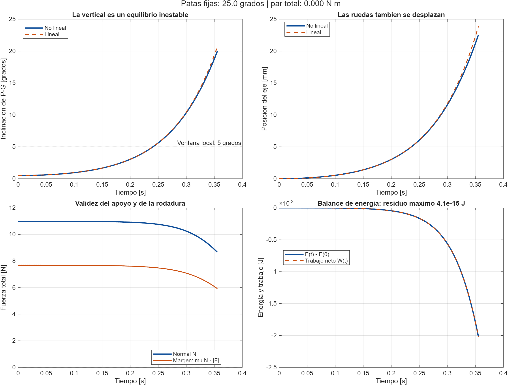

# Resultado del pendulo invertido

- Corrida: 2026-10-03 14:58:43 -0300 (Buenos Aires).
- MATLAB: 25.2.0.2998904 (R2025b).
- Commit base: `2d2d49371fb23f0e366d05ca71a5e1090f9d3137`; incorpora archivos locales del modelo nuevo.
- Variante: `segunda_iteracion`; postura fija: 25.0 grados.
- Fuente: `modelado/parametros/parametros_fisicos.m`. Masas/CoM/inercias estimados; rotor y electricidad omitidos.
- Solver: ode45; RelTol 1.0e-09; AbsTol 1.0e-11; MaxStep 1.0e-03 s.

| Parametro | Valor SI |
|---|---:|
| Masa cuerpo [kg] | 1.059800000 |
| Masa ruedas [kg] | 0.060000000 |
| Radio [m] | 0.033000000 |
| Distancia P-G [m] | 0.074773119 |
| J_G [kg m2] | 0.00439283676 |
| J_ruedas [kg m2] | 3.267e-05 |
| Chasis en equilibrio [grados] | -0.154442 |
| b_eje [N m s/rad] | 0.0002 |
| b_phi [N m s/rad] | 0.001 |
| b_x [N s/m] | 0 |
| mu | 0.7 |

Estado inicial `[x, v, phi, omega]`: `[0 0 0.0087266463 0]` (SI). Par total: 0.000000 N m.

Duracion solicitada 1.000000 s; limite angular 20.0 grados.

Fin en **0.355549 s**: Limite angular de demostracion.

- Error angular hasta 5 grados: 0.0114605446 grados.
- Normal minima: 8.655035343 N; margen minimo de adherencia: 5.920424538 N.
- Residuo maximo del balance de energia: 4.09221268e-15 J.
- Rango de controlabilidad: 4 de 4.

Orden de estado: `[x; v; phi; omega]`. Entrada: par total de las ruedas.

```text
A =
[0 1 0 0;0 -0.425355536 11.0318789 -0.0282276695;0 0 0 1;0 -3.85413333 160.067211 -0.333090009]
B =
[0;-70.1836635;0;-635.931999]
Autovalores =
[0;-12.9571769;-0.159664985;12.3583963]
```

El equilibrio superior es inestable. El lineal aproxima la dinamica local;
esta corrida no identifica parametros ni valida un controlador fisico.



[Datos](trayectoria.csv) | [MATLAB](resultado_base.mat)
